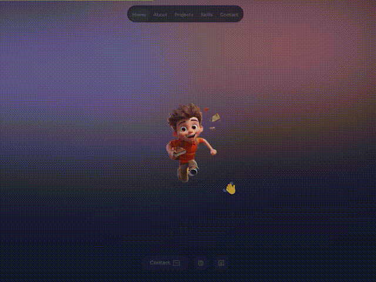
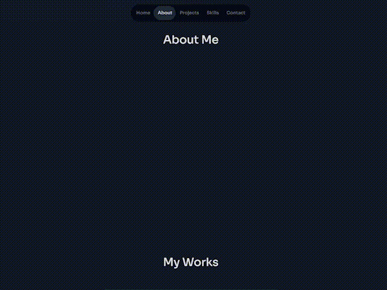
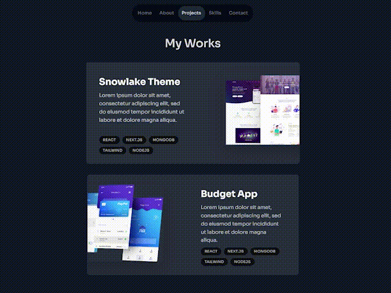

# 🌐 Demo Project: Framer motion + NextJs + TailwindCss
*Please choose your language:* [English](README.md) [Русский](README.ru.md)

🚀 A demo project showcasing beautiful and smooth animations using [Framer Motion](https://www.framer.com/motion/). This landing page is designed to demonstrate interactive UI/UX elements that enhance user experience.  

<!-- markdownlint-disable MD033 MD041 -->

<!-- markdownlint-enable MD033 -->

## 🖥️ You can check a demo!
### 🎯 [Live Preview](https://vladchashush.github.io/framer-motion-landing/) - Check out the fully responsive demo of this project in action!

## 🖼️ Preview  
### About me section

<!-- markdownlint-disable MD033 MD041 -->

<!-- markdownlint-enable MD033 -->

### My skill projects and sections

<!-- markdownlint-disable MD033 MD041 -->

<!-- markdownlint-enable MD033 -->

---

## 🔥 Features  

- 🪄 **Smooth Animations**: Powered by Framer Motion for seamless transitions and engaging effects.  
- 🌟 **Responsive Design**: Looks great on all devices, from desktops to mobile screens.  
- 🎨 **Customizable**: Easily adaptable for your projects.  

